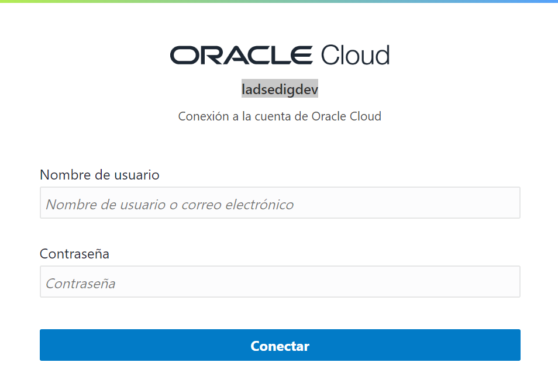
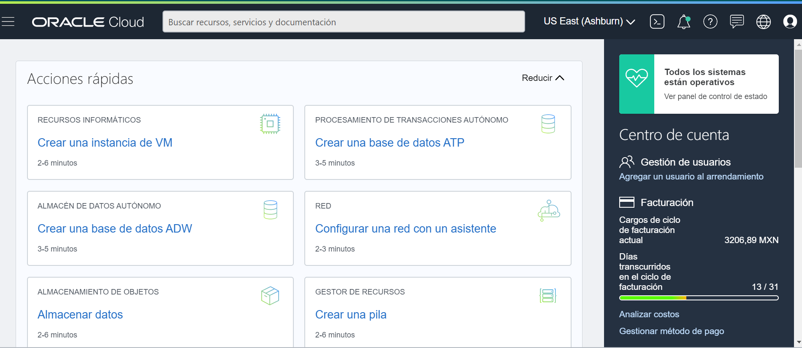
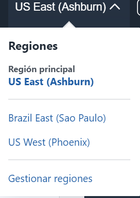

#  Laboratorio 1: Accediendo a Oracle Cloud  :rocket:

## Comenzando

- Acceder a la consola de Oracle Cloud
- Conocer la interfaz de Oracle Cloud
- Repasar conceptos de Arquitectura de OCI
- Cuestionario de repaso de los contenidos

## Pre-requisitos :clipboard:

- [Crear una cuenta Oracle Cloud](https://www.oracle.com/cloud/free/)

### Paso 1: Acceder a la consola de Oracle Cloud 

1. Ingresar a [Sign In](https://console.us-ashburn-1.oraclecloud.com/)
2. En la página de **inicio de sesión de Oracle Cloud Account**, ingrese las credenciales de su cuenta de Oracle Cloud y haga clic en **Iniciar sesión**.
  
  

3. Acceder a la consola: 
   - Verficiar usuario.
   - Region Principal
   - Espacio de trabajo 
   
   

4. Modificar region, suscribirse a una region secundaria:
   - Paso 1: Desplegar menu principal de regiones --> Parte superior de la consola
   - Paso 2: Verificar región principal.
   - Paso 3: Gestionar regiones.
   - Paso 4: Suscribirse a una nueva Región.
   
   
   
 
## Arquitectura de Oracle Cloud :pushpin:
