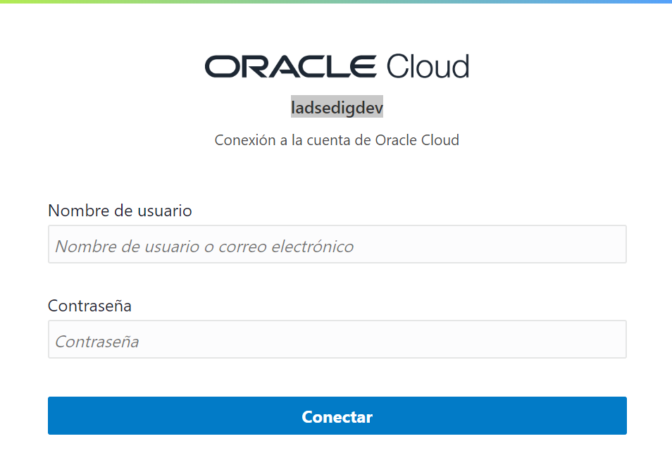
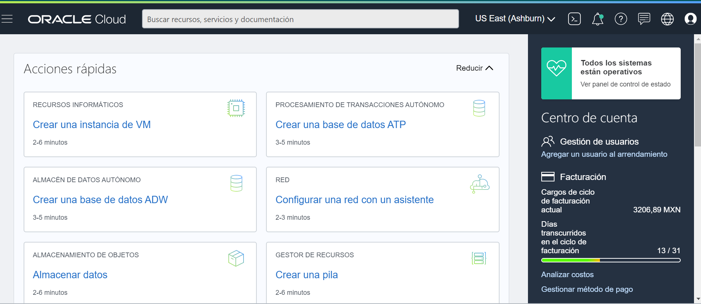
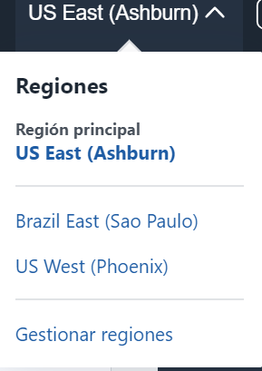
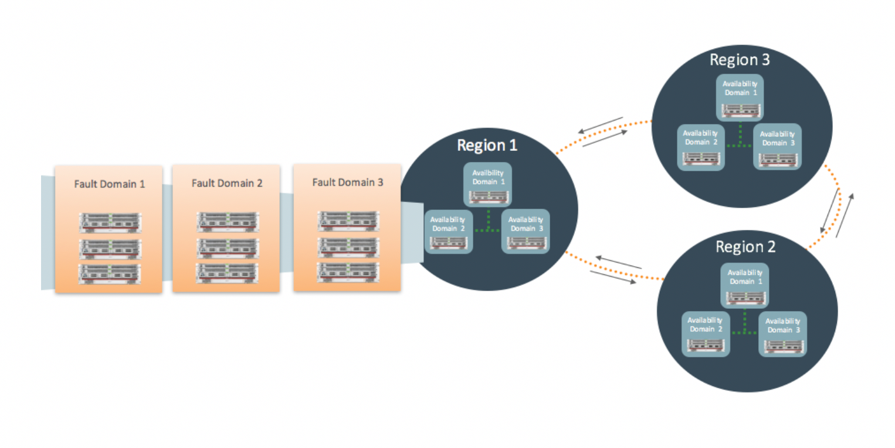
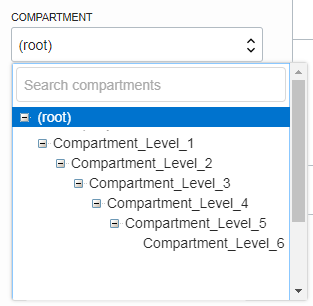

#  Laboratorio 1: Accediendo a Oracle Cloud  :rocket:

## Comenzando

- Acceder a la consola de Oracle Cloud
- Conocer la interfaz de Oracle Cloud
- Repasar conceptos de Arquitectura de OCI
- Cuestionario de repaso de los contenidos

## Pre-requisitos :clipboard:

- [Crear una cuenta Oracle Cloud](https://www.oracle.com/cloud/free/)

### Paso 1: Acceder a la consola de Oracle Cloud 

1. Ingresar a [Sign In](https://console.us-ashburn-1.oraclecloud.com/)
2. En la página de **inicio de sesión de Oracle Cloud Account**, ingrese las credenciales de su cuenta de Oracle Cloud y haga clic en **Iniciar sesión**.
  
  

3. Acceder a la consola: 
   - Verficiar usuario.
   - Región Principal.
   - Espacio de trabajo.
   
   

4. Suscribirse a una región secundaria:
   - Paso 1: Desplegar menu principal de regiones --> Parte superior de la consola
   - Paso 2: Verificar región principal.
   - Paso 3: Gestionar regiones.
   - Paso 4: Suscribirse a una nueva Región.
   
   
   .
## Arquitectura de Oracle Cloud :pushpin:

### Regiones y Dominio de Disponibilidad
Oracle Cloud Infrastructure está alojado en [regiones y dominios de disponibilidad](https://docs.cloud.oracle.com/en-us/iaas/Content/General/Concepts/regions.htm) . Una región es un área geográfica localizada, y un dominio de disponibilidad es uno o más centros de datos ubicados dentro de una región

 
 
Una región está compuesta por uno o más dominios de disponibilidad . La mayoría de los recursos de Oracle Cloud Infrastructure son específicos de una región, como una red de nube virtual, o específicos del dominio de disponibilidad , como una instancia de cómputo. El tráfico entre dominios de disponibilidad y entre regiones está cifrado.

 

#### Dominio de Falla
Un dominio de falla es una agrupación de hardware e infraestructura dentro de un dominio de disponibilidad . Cada dominio de disponibilidad contiene tres dominios de falla.
Caso de uso de Dominio de Falla:
- Proteger contra fallas inesperadas de hardware o fallas de la fuente de alimentación.
- Proteger contra interrupciones planificadas debido a Calcular el mantenimiento de hardware.

### Compartimientos
Los compartimentos son los bloques de construcción principales que utiliza para organizar sus recursos en la nube. Utiliza compartimentos para organizar y aislar tus recursos para que sea más fácil administrarlos y asegurar el acceso a ellos.

Cuando se aprovisiona su arrendamiento, se crea un compartimento raíz para usted. Su compartimento raíz contiene todos sus recursos en la nube. Puede pensar en el compartimento raíz como una carpeta raíz en un sistema de archivos.

 

Puede crear compartimentos debajo de su compartimento raíz para organizar sus recursos en la nube de una manera que se alinee con sus objetivos de gestión de recursos. A medida que crea compartimentos, controla el acceso a ellos creando políticas que especifican qué acciones pueden tomar los grupos de usuarios sobre los recursos en esos compartimentos.

#### Crear un compartimento :pencil2:

1. Abrir el menú de navegación . En **Gobierno y administración** --> **Identidad** y haga click en **Compartimentos** .

2. Navegar hasta el compartimento en el que desea crear el **nuevo compartimento**

3. Complete los campos solicitados:
   - _Nombre_:Máximo 100 caracteres.
   - _Descripción_ : puede modificar este paso mas adelante
   - _Compartimiento_: se muestra el comparimiento en el que esta posicionado.
   - _Etiquetas_: Opcional.
  
 3. Crear **Compartimiento**.
 
 ## Resumiendo :bulb:
1. Trabajamos con la Interfaz de Oracle Cloud.
2. Repasamos los conceptos básicos de la Arquitectura de Oracle Cloud.
3. Realizamos una suscripción a una región secundaria.
4. Creamos un Compartimiento.

## Para finalizar puedes realizar una prueba conceptual :trophy:

# Te espereamos en el próximo Laboratorio  :rocket:

[Regrasar a la Pagina Principal :arrow_left:](../README.md)
