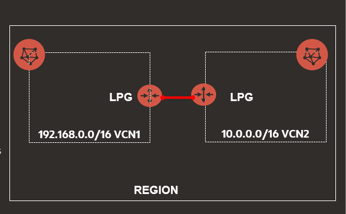
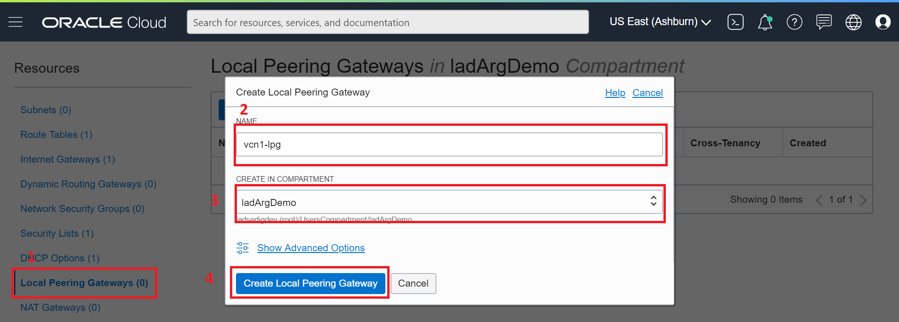
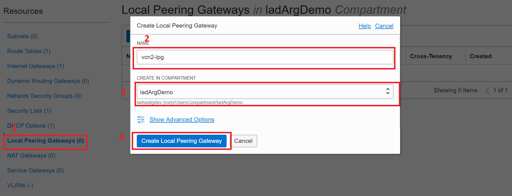
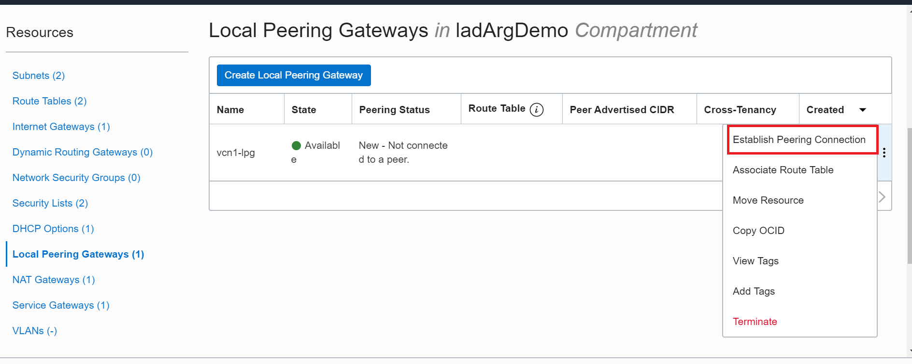
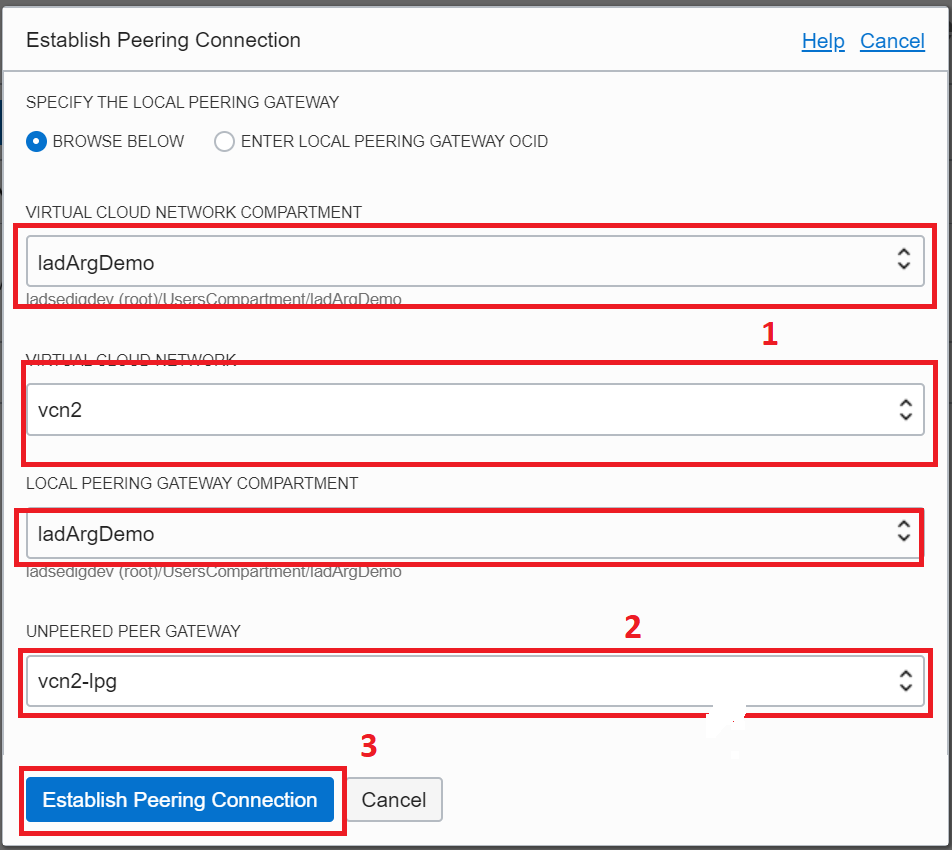

# Laboratorio 2: Redes OCI:computer:

## Objetivos

1. Descripción general de Redes.
2. Crear una Red en la consola de OCI. Componentes.
3. VCN Local Peering. 
4. VCN Remote Peering.

## Pre-requisitos
- [X] Laboratorio 1.
- Contar tres instancia de compute.

# RED VIRTUAL EN LA NUBE 

Una red virtual en la nube (VCN) es una red personalizable y privada de Oracle Cloud Infrastructure. Al igual que una red de centro de datos tradicional, la VCN le proporciona control completo de su entorno de red. 
La creación de una VCN implica algunos aspectos clave como:

* Asigne un bloque de IP privado para el VCN (rango CIDR para el VCN).
* Los clientes pueden traer sus propias direcciones IP RFC1918.
* Cree subredes dividiendo el rango CIDR en redes más pequeñas (subredes para front-end, back-end, base de datos)
* Cree una puerta de enlace de Internet opcional para conectar la subred VCN con Internet. Las instancias creadas en esta subred tendrán una dirección IP pública.
* Crear tabla de ruta con reglas de ruta para acceso a Internet
* Cree una lista de seguridad para permitir puertos relevantes para el acceso de entrada y salida

Un solo cliente puede tener múltiples VCN, lo que permite agrupar y aislar los recursos relacionados.

## Práctica 1: CREAR UNA RED VIRTUAL EN LA NUBE 

En este ejercicio, vamos a crear tres VCN y recursos separados en cada uno de ellos. 

| Nombre de VCN | REGION | 
|----------------|-------|
| vcn1 | US-ASHBURN |
| vcn2|US-ASHBURN |
| vcn3 |SA.SAOPAULO|

### Primer paso: Crear VCN demoVCN1R1 - Región 1 

1. Abrir el menú de navegación.  :arrow_right: **Infraestructura principal** :arrow_right: **Redes** :arrow_right:**Redes de nube virtual** .

Nota: Asegúrese de que su compartimento sea el compartimento seleccionado en el lado izquierdo de la consola.

2. Crear :arrow_right:**red virtual en la nube** .

3. En el cuadro de diálogo, ingrese un Name **vcn1** para su red de nube virtual.

4. Elija un bloque CIDR **192.168.0.0/16**, mantener las opciones restantes tal como están.

5. Haga click en Crear red virtual en la nube (Esto crea un VCN, y puede ver la página de detalles del VCN creado).
 
  
 

### *Ahora vamos a trabajar en el menu Recursos*

6. Navegue a **puertas de enlace de Internet** en el panel lateral izquierdo y haga click en **Crear puerta de enlace de Internet**. Proporcione un nombre como **InternetGW**

7. **Tabla de ruta** :arrow_right: modificar **Tabla de ruta predeterminada** para demovc1r1.

IMAGEN --------------------------------------------------------------------------

8. Click en Editar reglas de ruta y agregue otra regla con lo siguiente:

     |Tipo de destino |puerta de enlace a Internet|
     |-----------------|--------------------------|
     |**Bloque CIDR de destino**| **0.0.0.0/0**|
     |**Tipo de Objeto**| **Internet Gateway**|
     |**Puerta de enlace de Internet de destino**| **InternetGW**|
  
     
     
     
  
  
 ####  Ahora vamos a crear las subredes
 
 9. Redes :arrow_right: VCN :arrow_right: Crear Subredes
  
  | VCN | CIDR BLOCK | SUBRED | SUBRED CIDR BLOCK | SUBRED ACCESO | AD |
|----|--------------|-------|-------------------|---------------|----|
|vcn1 | 192.168.0.0/16 | Subred_ps1|192.168.1.0/24| Public | AD1|
|             |                | Subred_pv2| 192.168.2.0/24|Private | AD2|
|              |               | Subred_ps3| 192.168.3.0/24|Public | AD3|
|              |               | Subred_pv4 | 192.168.5.0/24 |Private | AD3|

### CREAR VCN2 REGION PRINCIPAL - VCN3 REGION SECUNDARIA: ASISTENTE DE VCN 

1. Región Principal: ASHBURN.

* Click en **Redes**:arrow_right:**Iniciar Asistente de VCN**

* Seleccionar :arrow_right: **VCN con  conexión a Internet** :arrow_right: **Iniciar

* Proporcionar un nombre. Por ejemplo: vcn2

* Verificar que todos los datos sean correctos :arrow_right: **Siguiente**

* Revisar y crear :arrow_right: **crear**

2. Repetir procedimiento para crear VCN en la región Secundaria.

# PRACTICA 2: VCN LOCAL PEERING 

Una pasarela de enlace local (LPG) es un componente de un VCN para enrutar el tráfico a un VCN vinculado localmente. Como parte de la configuración de los VCN, cada administrador debe crear un LPG para su VCN. Un VCN determinado debe tener un LPG separado para cada emparejamiento local que establezca (máximo 10 LPG por VCN). En la API, un LocalPeeringGateway es un objeto que contiene información sobre el emparejamiento. No puede reutilizar un LPG para establecer más tarde otro peering con él.

PASO 1:  Haga clic en Crear enlace de enlace local y cree dos LPG uno por uno. (vcn1 y vcn2)

   

**PASO 2:  Conexión Peering VCN Local**

En esta práctica, crearemos conexiones de interconexión entre los VCN:

VCN1 :left_right_arrow: VCN2

:one:  Vaya a *vcn1* -> Puertas de enlace de emparejamiento local:

:two: Haga clic en vcn1 y establezca la conexión con **vcn2-lp** LPG (el cuadro de diálogo resultante le permite elegir el VCN y el LPG con el que desea mirar).

* Compartimiento de red de nube virtual: el compartimiento que contiene el VCN con el que desea mirar.

* Red virtual en la nube: el VCN con el que deseas mirar.

* Compartimiento de la puerta de enlace local: el compartimiento que contiene el GLP con el que desea establecer la conexión.

*  Unpeered Peer Gateway: el LPG con el que desea establecer la conexión.

:three: Repitir el procedimiento para vcn2.

Una vez que las conexiones se han conectado con éxito, debemos modificar las tablas de ruta y las listas de seguridad asociadas con cada subred para enrutar y permitir el tráfico.

**vcn1**
1. **Tablas de ruta** y agregue una regla de ruta en la tabla de enrutamiento predeterminada con lo siguiente:
    *Tipo de objetivo: Local Peering Gateway*
    *Destino CIDR: ----(vcn2)*
    *Compartimiento objetivo: -----*
    *Puerta de enlace de enlace local de destino: vcn2-lp*

2. **Listas de seguridad**, y agregue una regla de lista de seguridad de ingreso en las listas de seguridad predeterminadas para el tráfico ICMP. En este ejemplo, solo estamos probando el tráfico ICMP, por lo que agregamos una regla ICMP. Para el tráfico TCP, se pueden agregar reglas TCP relevantes.

Haga clic en Editar reglas y agregue lo siguiente:

    * Fuente CIDR: vcn2

    * Protocolo IP: ICMP

    * Tipo: Todos
 
 **vcn2**
1. **Tablas de ruta** y agregue una regla de ruta en la tabla de enrutamiento predeterminada con lo siguiente:
    *Tipo de objetivo: Local Peering Gateway*
    *Destino CIDR: ----(vcn1)*
    *Compartimiento objetivo: -----*
    *Puerta de enlace de enlace local de destino: vcn1-lp*

2. **Listas de seguridad**, y agregue una regla de lista de seguridad de ingreso en las listas de seguridad predeterminadas para el tráfico ICMP. En este ejemplo, solo estamos probando el tráfico ICMP, por lo que agregamos una regla ICMP. Para el tráfico TCP, se pueden agregar reglas TCP relevantes.

Haga clic en Editar reglas y agregue lo siguiente:

    * Fuente CIDR: vcn1

    * Protocolo IP: ICMP

    * Tipo: Todos
    
    

     
     
   

