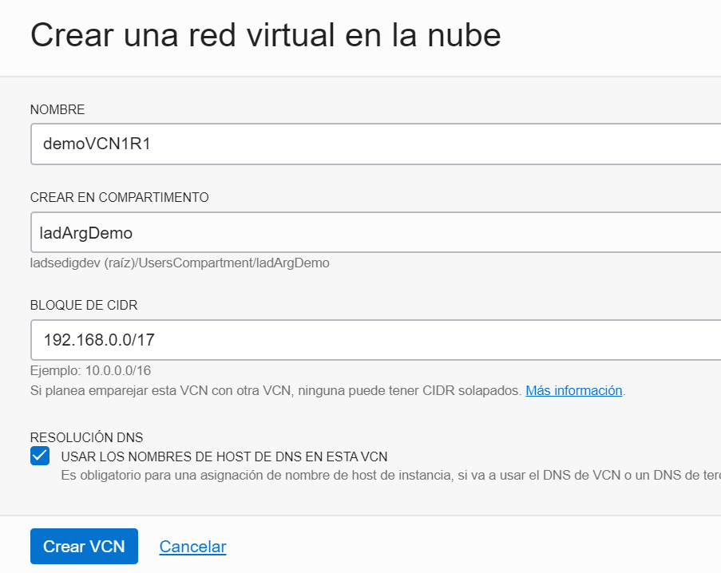
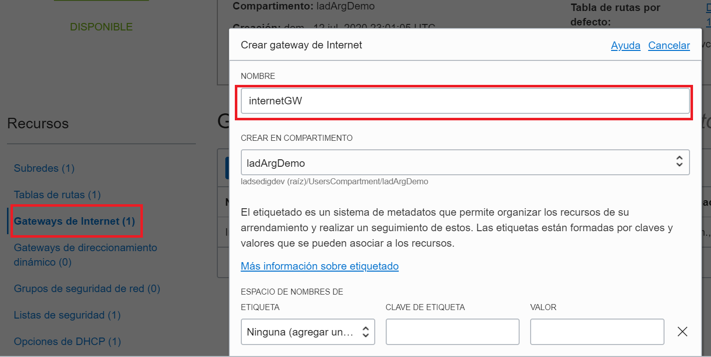
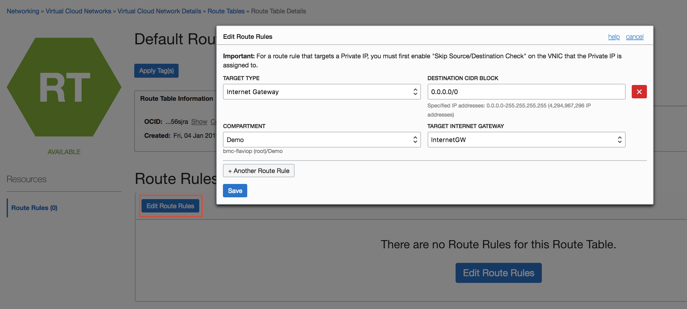

# Laboratorio 2: Redes OCI:computer:

## Objetivos

1. Descripción general de Redes.
2. Crear una Red en la consola de OCI. Componentes.
3. VCN Local Peering. 
4. VCN Remote Peering.

## Pre-requisitos
- [X] Laboratorio 1.
- Contar tres instancia de compute.

## Práctica 1: CREAR UNA RED VIRTUAL EN LA NUBE 

En este ejercicio, vamos a crear tres VCN y recursos separados en cada uno de ellos. 

| Nombre de VCN | REGION | 
|----------------|-------|
| demoVCN1R1 | US-ASHBURN |
| demoVCN2R1|US-ASHBURN |
| demoVCN3R2 |SA.SAOPAULO|

### Primer paso: Crear VCN demoVCN1R1 - Región 1 

1. Abre el menú de navegación. En **Infraestructura principal** , vaya a **Redes** y haga click en **Redes de nube virtual** .

Nota: Asegúrese de que su compartimento sea el compartimento seleccionado en el lado izquierdo de la consola.

2. Haga clic en Crear **red virtual en la nube** .

3. En el cuadro de diálogo, ingrese un Name demoVCN1R1 para su red de nube virtual.

4. Asegúrese de que Crear solo red virtual en la nube esté seleccionado.

5. Elija un bloque CIDR **192.168.0.0/16**, mantener las opciones restantes tal como están.

6. Haga click en Crear red virtual en la nube (Esto crea un VCN, y puede ver la página de detalles del VCN creado.
 
  
 

### Ahora crearemos recursos adicionales necesarios para las instancias en este demoVCN1R1

7. Navegue a **puertas de enlace de Internet** en el panel lateral izquierdo y haga click en **Crear puerta de enlace de Internet**. Proporcione un nombre como **InternetGW**

8. Haga clic en Tabla de ruta predeterminada para ManagementVCN .

9. Click en Editar reglas de ruta y agregue otra regla con lo siguiente:

     |Tipo de destino |puerta de enlace a Internet|
     |-----------------|--------------------------|
     |**Bloque CIDR de destino**| **0.0.0.0/0**|
     |**Puerta de enlace de Internet de destino**| **InternetGW**|
     
     
     
  
  
 ####  Ahora vamos a crear las subredes
 
 10. Redes :arrow_right: VCN :arrow_right: Crear Subredes
  
  | VCN | CIDR BLOCK | SUBRED | SUBRED CIDR BLOCK | SUBRED ACCESO | AD |
|----|--------------|-------|-------------------|---------------|----|
|VCN1region1 | 192.168.0.0/16 | Subred_ps1|192.168.1.0/24| Public | AD1|
|             |                | Subred_pv2| 192.168.2.0/24|Private | AD2|
|              |               | Subred_ps3| 192.168.3.0/24|Public | AD3|
|              |               | Subred_pv4 | 192.168.5.0/24 |Private | AD3|

### CREAR VCN2 REGION PRINCIPAL - VCN3 REGION SECUNDARIA: ASISTENTE DE VCN 

1. Región Principal: ASHBURN.

* Click en **Redes**:arrow_right:**Iniciar Asistente de VCN**

* Seleccionar :arrow_right: **VCN con  conexión a Internet** :arrow_right: **Iniciar

* Proporcionar un nombre. Por ejemplo: VCN2region1

* Verificar que todos los datos sean correctos :arrow_right: **Siguiente**

* Revisar y crear :arrow_right: **crear**

2. Repetir procedimiento para crear VCN en la región Secundaria.

# Práctica 2: Crear una instancia por VCN- Región Principal 

En esta práctica, creará instancias en cada uno de las VCN creadas en la Región principal: 

1. Menú :arrow_right: Calcular :arrow_right:Instancias :arrow_right:Crear instancia
2. Complete con la información que se detalla a cotinuación:

| XXXXXX | XXXXXXXXXXX|
|--------|------------|
|Nombre | web1|
|Dominio de disponibilidad|AD-1|
|Imagen del sistema operativo|Oracle Linux 7.6|
|Tipo de instancia |máquina virtual|
|Forma de instancia| VM.Standard2.1|
|Claves SSH | agregue su clave pública SSH|
|Virtual Cloud Network | demoVCN1R1|
|Subred | Subred_ps1|

3. Deje el resto como predeterminado y haga clicK en Crear.

4. Crear instancia n°2 en VCN demoVNC2R1

| XXXXXX | XXXXXXXXXXX|
|--------|------------|
|Nombre | web2|
|Dominio de disponibilidad|AD-2|
|Imagen del sistema operativo|Oracle Linux 7.6|
|Tipo de instancia |máquina virtual|
|Forma de instancia| VM.Standard2.1|
|Claves SSH | agregue su clave pública SSH|
|Virtual Cloud Network | demoVCN2R1|
|Subred | Subred Pública|

En esta práctica, crearemos conexiones de interconexión entre VCN:

5. Crear Peering VCN Local

demoVCN1R1 :left_right_arrow: demoVCN2R1

:cinema:

     
     
   

