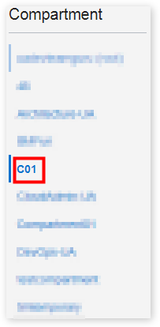
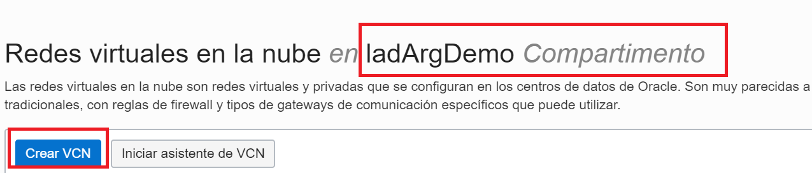
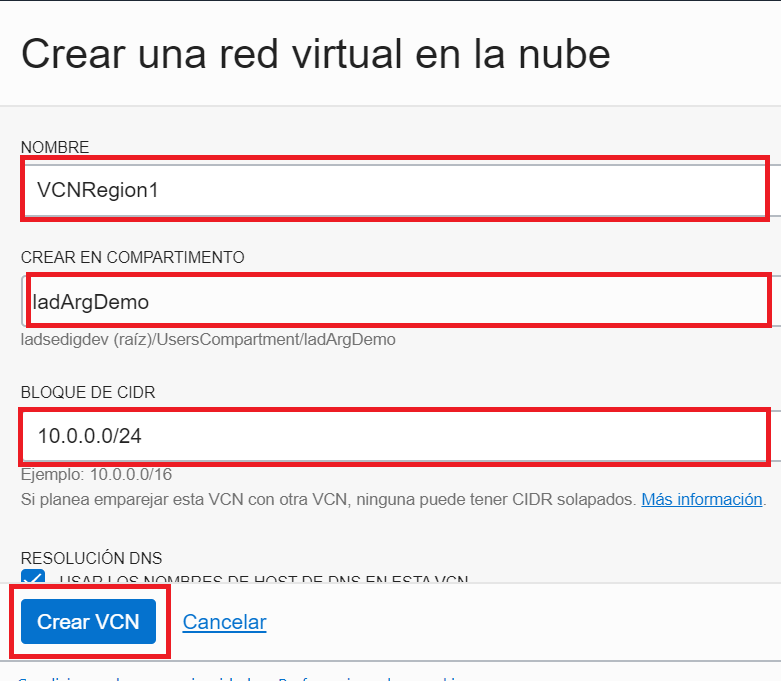

# Laboratorio 2: Redes OCI:computer:

## Objetivos

1. Descripción general de Redes.
2. Crear una Red en la consola de OCI. Componentes.
3. VCN Local Peering. 
4. VCN Remote Peering.

## Pre-requisitos
- [X] Laboratorio 1.
- Contar tres instancia de compute.

#### Paso 1: Crear VCN

En este ejercicio, vamos a crear tres VCN y recursos separados en cada uno de ellos. Teniendo en cuenta lo siguiente:

- Crear dos VCN en la **región principal**.
- Crear una VCN en una **región secundaria**.

1. Abrir el menú de navegación. En **Infraestructura básica** :arrow_right: **Redes** :arrow_right: **Redes virtuales en la nube**.
2. Verificar si se encuentra trabajando en el **compartimiento** correcto.

3. **Crear red virtual en la nube**.

4. Ingresar la informacion que se detalla a continuación:

   -**_Nombre_**: VCN1region1
   -**_Crear en compartimiento_**: déjelo tal cual.
   -**_Bloque CIDR_**: 192.168.0.0/16
  
  

5. **Crear VCN**.

#### Paso 2: Crear subredes

1. Ir a la VCN que se creo anteriormente. 
2. 

