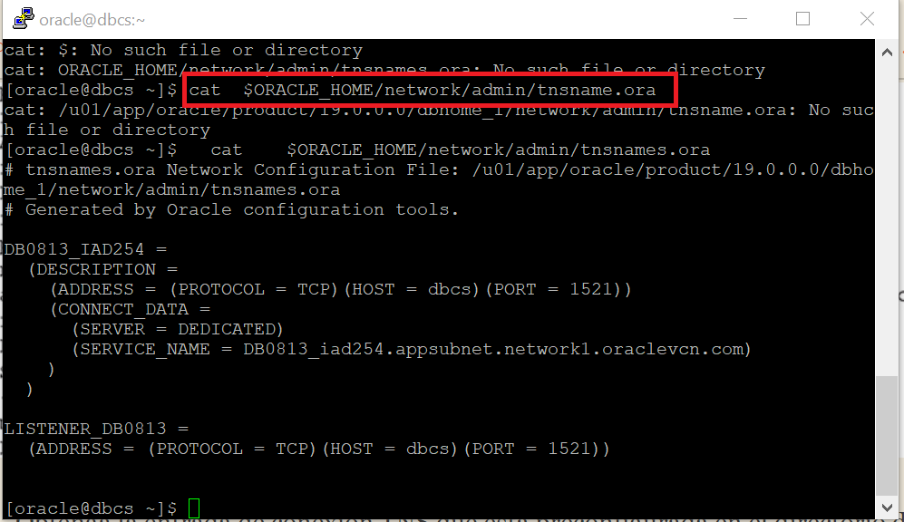

 # LABORATORIO 3
 

## SERVICIO DE BASE DE DATOS EN LA NUBE 

## Cuando obtiene la licencia de la base de datos, tiene acceso a algunas funciones principales

## REQUISITOS PREVIOS PARA TENER EXITOS EN LABORATORIO

* Crear VCN con una subred pública; Luego crea una puerta de enlace de servicio y configura su tabla de rutas y lista de seguridad predeterminadas.
## GUIA 

* Practica 1: Crear un sistema de Base de Datos en una Maquina Virtual
* Practica 2: Conectar el sistema de Base de Datos con SSH, SQL * Plus

## PRACTICA 1: Crear un sistema de base de datos en una máquina virtual

En este ejercicio, creará un sistema DBCS en una VM mediante la consola OCI.

1.    **Inicie sesión** en la consola OCI y elija su compartimento.

2.    Navegue hasta **Bare Metal, VM y Exadata y elija Launch DB System**.

3.    Proporcione un **nombre**, como **dbcs2020**, y elija un **AD** donde se crearán recursos como la instancia de computación de VM subyacente a la base de datos.

4.    Explore las relaciones entre formas y edición. Tenga en cuenta que si elige **Bare Metal** o Exadata como tipo de forma, sus opciones de forma cambian en consecuencia.       Si elige una forma que admita RAC, como VM.Standard2.2, puede aumentar el recuento de nodos a 2, haciendo que la edición del software de la base de datos se mueva             automáticamente a EE-EP. Si configura la edición de software en SE, su elección de formas de VM disponibles se reduce a aquellas con ocho OCPU o menos.

5.    Elija un tipo de forma de VM y una forma adecuada, como VM.Standard2.1. Tenga en cuenta que el recuento total de nodos es 1. No puede crear un sistema de base de datos         RAC con esta forma de máquina virtual.

6.    Elija una edición de software, como Standard Edition, y su tipo de licencia, ya sea con la licencia incluida (el costo de OCI es mayor) o traiga su propia licencia           (BYOL).Cuando la instancia no está en uso, puede detenerla y se le cobrará solo por el almacenamiento total asignado, así que tenga esto en cuenta al elegir la               asignación de almacenamiento inicial. Para una solicitud inicial de almacenamiento disponible de 256 GB, se le cobrará por el almacenamiento total (en gris) de 712 GB.       DBCS en el almacenamiento de VM es almacenamiento en bloque, y una vez que se crea el nodo, puede investigar exactamente cómo se asigna el almacenamiento total. Los           componentes   principales son dos discos ASM de 256 GB para los discos DATA y RECO y aproximadamente 200 GB para el sistema de archivos / u01. Especifique una clave           pública SSH como lo haría para cualquier instancia informática.
 
 

 7.    Expanda las Opciones avanzadas y, opcionalmente, elija un dominio de error. En un sistema de base de datos RAC, es importante especificar varios dominios de fallas.          Especifique la información de red para este sistema de base de datos. En este ejemplo, se elige una subred pública, pero las bases de datos normalmente residirían en          una subred privada. Especifique un prefijo de nombre de host.
 
 8.  Especifique un nombre de base de datos y elija una versión, por ejemplo demodb y 18.3.0.0. De forma predeterminada, solo se enumeran las versiones base. Al marcar la         casilla de verificación Mostrar todas las versiones disponibles, se expande la lista para incluir también las versiones que se han parcheado o                                 actualizado.
 
 
 
 9)   Opcionalmente, especifique un nombre de PDB. De forma predeterminada, a menos que la versión elegida sea 11.2.0.4, la base de datos se creará como un CDB. Especifique         la contraseña de administrador de la base de datos establecida para los usuarios de SYS y SYSTEM, así como la billetera TDE y el administrador de PDB.
 
10)   Habilitar  **automatic backups**, Backup retention period: 30 dias, Backup scheduling (UTC): 

11)   La sección de carga de trabajo de la base de datos puede ser OLTP o DSS. Si se elige la edición estándar, esta opción predeterminada es OLTP. Esta elección influye en         si la configuración de la base de datos está sesgada hacia la carga de trabajo transaccional con mucha actividad de acceso a datos aleatorios (OLTP) o hacia una carga         de trabajo del sistema de soporte de decisiones (DSS) que normalmente tiene una gran actividad de escaneo

12)   Las opciones avanzadas le permiten especificar el juego de caracteres de la base de datos y el juego de caracteres nacional. Elija Launch DB System para comenzar el           proceso de aprovisionamiento. Esto lleva un tiempo y el tiempo varía.

13)  Navegue a Bare Metal, VM y Exadata, y elija dbcs2020. Los recursos implementados incluyen un nodo, una base de datos y los parches que se prueban y están disponibles          para que los aplique. La información del sistema de base de datos se resume y el demodb se enumera aquí.

## PRACTICA 2: Conectar al sistema de base de datos con SSH, SQL * Plus

En este ejercicio, se conecta al nodo de la base de datos y se conecta a la base de datos mediante la utilidad SQL * Plus.

1.    Inicie sesión en la consola OCI y elija su compartimento.

2.    Vaya a Bare Metal, VM y Exadata | dbcs2020| Nodos y tome nota de la dirección IP pública del host.

3.    Con la clave privada emparejada con la clave pública que proporcionó al crear el sistema de base de datos, inicie una conexión SSH a este servidor utilizando un cliente SSH como PuTTY.

4.    Una vez conectado como usuario opc, confirme el nombre de host y la versión del sistema operativo, examine el diseño del sistema de archivos,verifique si hay procesos         de Oracle PMON y familiarícese con su nuevo servidor de base de datos.
 

5.    Observe que hay procesos en segundo plano PMON para la instancia de ASM + ASM1, la instancia de proxy de ASM + APX1 y la instancia de base de datos dbcs2020. Esta es la       instancia de base de datos a la que deseamos conectarnos, así que cambie el usuario de opc a oracle, confirme si la variable ORACLE_SID está configurada correctamente         y conéctese usando SQL * Plus.
 
 
6.   Obtenga la entrada de conexión TNS que está preconfigurada en el directorio de inicio de la base de datos. La ubicación predeterminada es 
      $ ORACLE_HOME / network / admin/ tnsnames.ora
      
  
7.   Observe en el Paso 4 que la instancia de ASM se ejecuta como el usuario de Linux llamado grid. Cambie el usuario de nuevo a opc; luego cambie de usuario      a la cuadrícula y averigüe la ubicación del directorio de la cuadrícula de inicio de ORACLE.
       
8.   Establezca las variables de entorno necesarias y ejecute el comando asmcmd list disk groups. Tenga en cuenta que se asignan 256 GB a los grupos de            discos DATA y RECO ASM. Su resultado puede diferir si eligió una asignación de almacenamiento más grande cuando creó el sistema de base de datos.
       

## Para finalizar puedes realizar una prueba conceptual :trophy:

# Te espereamos en el próximo Laboratorio  :rocket:

[Regrasar a la Pagina Principal :arrow_left:](../README.md)

