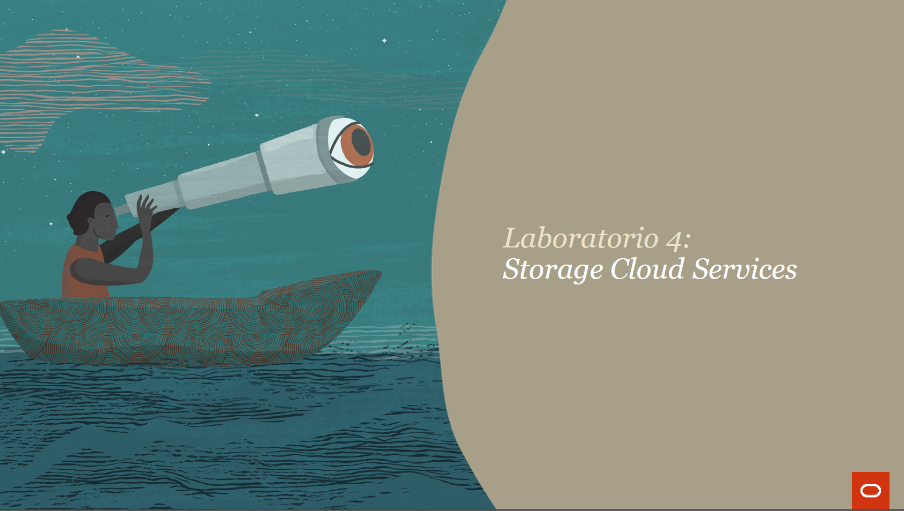
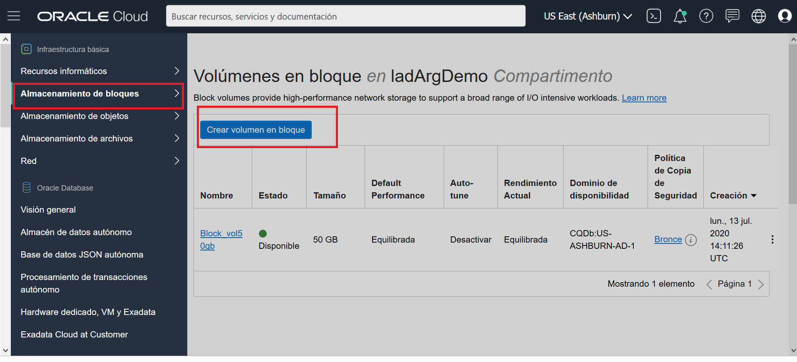
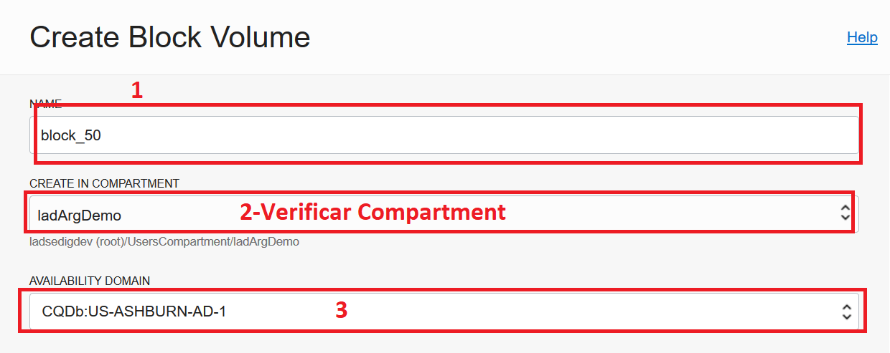
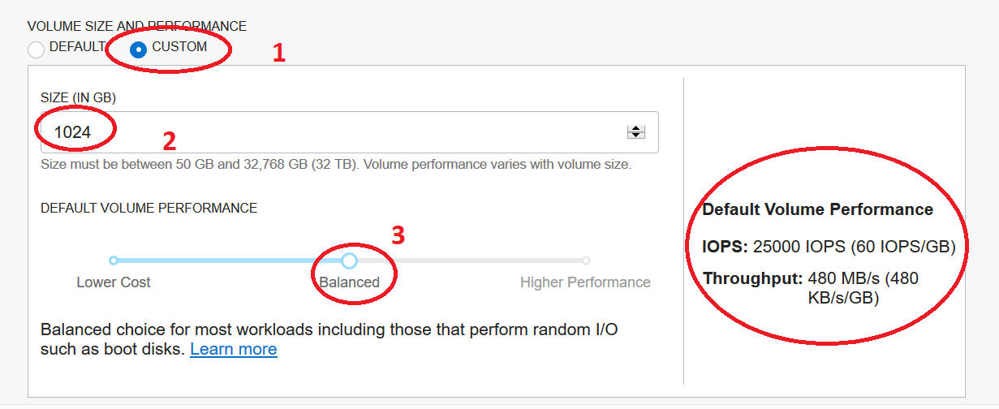
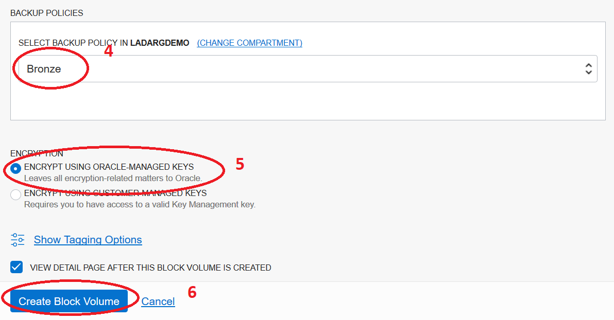
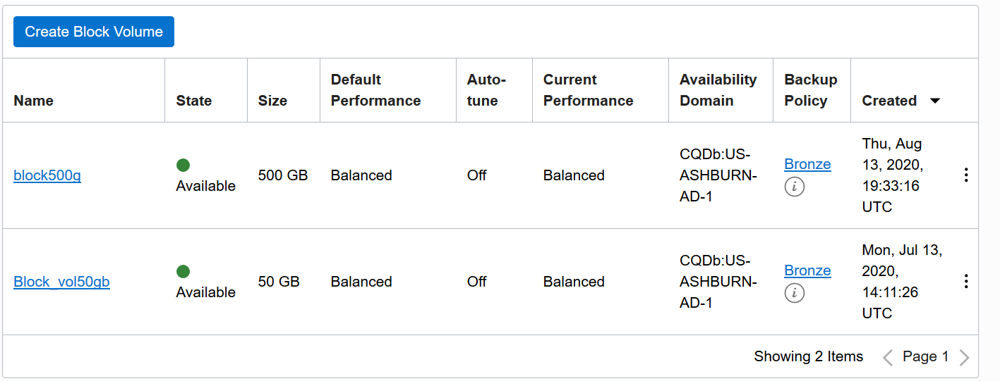
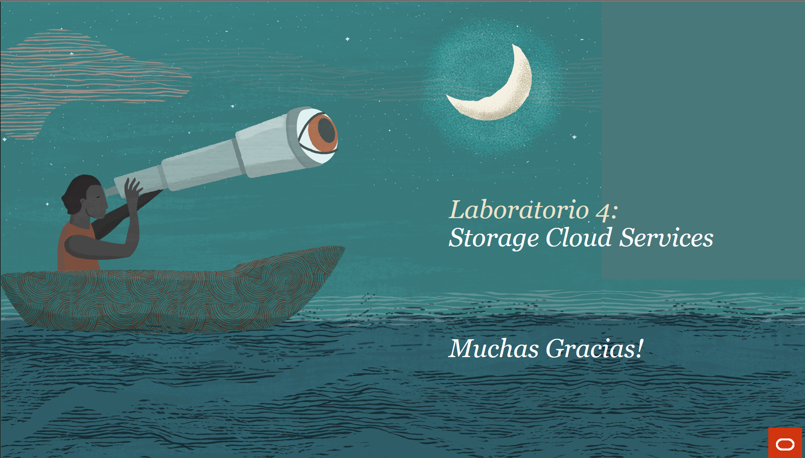

## LABORATORIO 4

  

## Objetivos
• Crear  un block volume storage  (50 GB y 500 GB) y asigne volúmenes de almacenamiento en bloque a instancias informáticas
• Configurar opciones de respaldo

## Paso1: Crear Block Storage Volumes

1.	Acceder a la interfaz de OCI
2.	Menú de Servicios, clic en Block Storage
3.	Crear Almacenamiento en Bloque  y complete la informacion solicitada.
  
  
    
  
* **Name: block_vol50GB**
* **Create in Compartment: Compartimento**
* **Virtual Cloud Network: VCN-Trial**
* **Availability Domain: AD2**
* **Size: 50GB**
* **Backup Policy: Bronze**
* **Volume Performance: Balanced**

  
  
  
  
  
  
  Repita los pasos anteriores y cree un almacenamiento en bloque de 500 GB;
  
  
* **Name: block_vol500GB**
* **Create in Compartment: Compartimento**
* **Virtual Cloud Network: VCN-Trial**
* **Availability Domain: AD2**
* **Size: 500GB**
* **Backup Policy: Bronze**
* **Volume Performance: Balanced**

  
  
  ## Paso2: Crear una Conexión de Block Volume a la instancia de Compute
  
1.	Para conectar Block Volumes a instancias de compute, debe acceder desde el menú de servicios de la consola de OCI, click en "Compute Instance" y, desde       la página de detalles de la VM, presione "Adjuntar volumen de bloque"
 
 
2. Instancia de Compute -->  Maquina Virtual 

3. Resources --> Attached Block Volumes --> Click en Attached Block Volume

4. Completar la informacion requerida: 

* Volume attachment type: iSCSI
* Select volume: Block_50
* Device path: /dev/oracleoci/oraclevdc
* Access: Read/Write
* Crear 

  
   
*  **ISCSI: el disco debe detectarse manualmente (fdisk)**
* **PARAVIRTUALIZADO: el disco se detecta automáticamente**
* **Pero en ambos casos, el disco debe montarse manualmente**
    
    
* Volume attachment type: iSCSI
* Select volume: Block_500
* Device path: /dev/oracleoci/oraclevdc
* Access: Read/Write
* Crear 

Una vez que los discos están conectados correctamente, podemos montarlos en la instancia de Compute.

Para facilitar el proceso de conexión del disco, Oracle Cloud Infrastructure proporciona los comandos necesarios para detectar el nuevo disco de la VM. 

En el lado derecho de la información del disco, encontrará un **menú de tres puntos**.

Seleccione: **iSCSI Information and Commands**

### Ejecute el procedimiento para los discos de 50 GB y 500 GB

Todo lo que necesita hacer es copiar los comandos y ejecutarlos en el servidor Linux.

### Detección del disco, formatear y montar el nuevo disco:

1. Conectar con root **sudo su -**

2. Detectar el nuevo dispositivo con el comando **"fdisk -l"**
   + Disco: /dev/sdb     
   + Disco: /dev/sdc
3. Formatear el disco: 
   + Ejecutar el comando: **mkfs/dev/sdb**
   + Ejecutar el comando: **mkfs/dev/sdc**
 
4. Montar el sistema de Archivos:
   + Ejecutar el comando: mkdir/block_50
   + Ejecutar el comando: mount /dev/sdc/block_50
   + Ejecutar el comando: df -kh
   
   + Ejecutar el comando: mkdir/block_500
   + Ejecutar el comando: mount /dev/sdb/block_500
   + Ejecutar el comando: df -kh
   
  ## PASO 3: Prueba del rendimiento del volumen de bloques
  
Según nuestra [documentación](https://docs.cloud.oracle.com/es-ww/iaas/Content/Block/Concepts/blockvolumeperformance.htm), el rendimiento de Block Volume puede variar de **3.000 IOPS a 25.000 IOPS** según el tamaño del disco. 

En la siguiente prueba, validaremos el rendimiento real entregado por el volumen de bloques aprovisionado.

Paso 1 Pruebe el verdadero rendimiento del Volumen de bloque ya aprovisionado (/dev/sdb):

1.  Instale la utilidad [**FIO**](https://docs.cloud.oracle.com/en-us/iaas/Content/Block/References/samplefiocommandslinux.htm) en la instancia de Linux Compute creada recientemente: 

* ROOT, emita el comando: **yum install fio**

2.  Ejecute la utilidad FIO en el nuevo disco: 

    + sudo fio--filename=/dev/sdb--direct=1--rw=randread--bs=4k\
    + --ioengine=libaio --iodepth=256 --runtime=30 --numjobs=4 --time_based \
    + --group_reporting --name=iops-test-job --eta-newline=1 --readonly
    
    
    + sudo fio--filename=/dev/sdc--direct=1--rw=randread--bs=4k\
    + --ioengine=libaio --iodepth=256 --runtime=30 --numjobs=4 --time_based \
    + --group_reporting --name=iops-test-job --eta-newline=1 --readonly

3. Verificar Rendimiento. 

 ## PASO 3: Prueba del rendimiento del volumen de bloques

Establecer políticas de respaldo

En Oracle Cloud Infrastructure, Block Volume (incluidos los volúmenes de arranque) y las copias de seguridad de los nodos de cómputo son independientes. 

Las políticas de respaldo se pueden configurar en la página de inicio de **Block Storage** 

* Menú principal --> Block Storage  -->  Block Volumes

Se puede acceder fácilmente a las opciones de copia de seguridad desde el **"menú rápido"** (tres puntos a la derecha), opción **"Asignar política de copia de seguridad"**

Puede elegir la política de respaldo más adecuada para sus datos.

## Resumiendo :bulb:
1. 
2. Repasamos los conceptos básicos de la Arquitectura de Oracle Cloud.
3. Realizamos una suscripción a una región secundaria.
4. Creamos un Compartimiento.

## Para finalizar puedes realizar una prueba conceptual :trophy:

# Te espereamos en el próximo Laboratorio  :rocket:

 
 
 
[Regrasar a la Pagina Principal :arrow_left:](../README.md)

    
   
  
   
   

         
  
  

