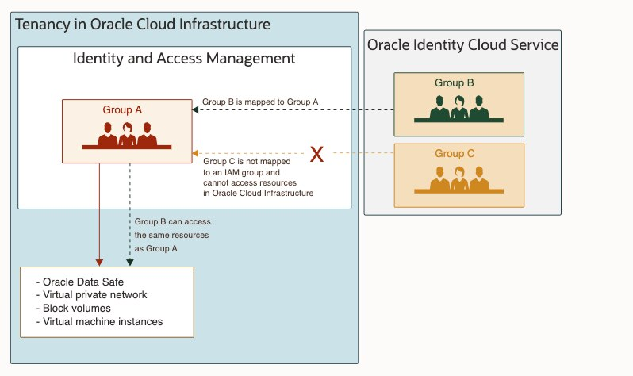

## LABORATORIO 6 Mantener su almacén de datos autónomo seguro con Data Safe

 
Data Safe ofrece capacidades de seguridad de datos esenciales como un servicio en Oracle Cloud Infrastructure. 

Esencialmente, lo ayuda a comprender la confidencialidad de sus datos, evaluar los riesgos de los datos, enmascarar los datos confidenciales, implementar y monitorear los controles de seguridad, evaluar la seguridad del usuario, monitorear la actividad del usuario y abordar los requisitos de cumplimiento de seguridad de los datos.

## Data Safe Console

Oracle Data Safe es un centro de control basado en la nube para la seguridad de bases de datos. Data Safe permite el monitoreo de las pautas de seguridad de la base de datos Oracle y el enmascaramiento de datos confidenciales en la base de datos Oracle. Actualmente, Oracle Data Safe solo se ofrece en Oracle Cloud, las bases de datos de Oracle que se supervisarán también se limitan a las bases de datos de Oracle Cloud Infrastructure.

Para poder utilizar Data Safe, se requiere un inquilino de Oracle Cloud Infrastructure y derechos de acceso administrativo para la implementación.

1. Configurar los usuarios
2. Activar Data Safe
3. Registro de las bases de datos Oracle en Data Safe

El usuario seguro de datos debe crearse en Oracle Cloud Infrastructure (OCI), puede ser un usuario local o federado. Federación significa: el usuario se crea en un sistema de gestión de identidad central y se sincroniza en la OCI. 

El servicio predeterminado de IDM de la OCI es Oracle Identity Cloud Service (IDCS), pero también puede ser reemplazado por otros sistemas (Active Directory, etc.).

En la práctica, ha resultado útil dividir a los usuarios en grupos. A estos grupos se les asignan diferentes derechos que se adaptan a las tareas. Por ejemplo, se crea un grupo de administración que configura nuevos destinos de base de datos en Data Safe y otro grupo de usuarios que solo tiene acceso de lectura a los resultados del monitoreo. Es importante que el usuario y, en su caso, el grupo estén disponibles en OCI.

 
 
 ## Paso 1: Configurar Política 

1. Menú> Identidad> Políticas

## Paso 2: Activar Data Safe

_Allow group <eine existierende Gruppe> to manage data-safe in tenancy_
