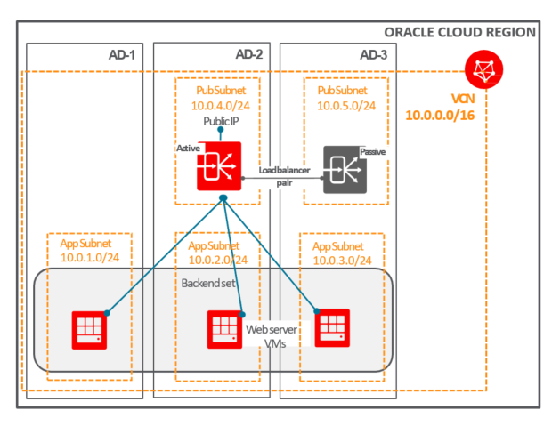

# LABOTORIO 6: BALANCEADOR DE CARGA 

El servicio de equilibrio de carga de Oracle Cloud Infrastructure proporciona una distribución automatizada del tráfico desde un punto de entrada a varios servidores accesibles desde su red de nube virtual (VCN). El servicio ofrece un equilibrador de carga con su elección de dirección IP pública o privada y ancho de banda provisto.

El servicio de equilibrio de carga le permite crear un equilibrador de carga público o privado dentro de su VCN. Un equilibrador de carga público tiene una dirección IP pública a la que se puede acceder desde Internet. Un equilibrador de carga privado tiene una dirección IP de la subred de alojamiento, que solo es visible dentro de su VCN. Puede configurar múltiples para una dirección IP para equilibrar la carga del tráfico de Capa 4 y Capa 7 (TCP y HTTP). Los equilibradores de carga públicos y privados pueden enrutar el tráfico de datos a cualquier servidor backend al que se pueda acceder desde la VCN.

Su balanceador de carga tiene un backend configurado para enrutar el tráfico entrante a sus instancias de Compute. El conjunto de backend es una entidad lógica que incluye:

-  Una lista de servidores backend.
-  Una política de equilibrio de carga.
-  Una política de chequeo de salud.
-  Manejo de SSL opcional.
-  Configuración de persistencia de sesión opcional

## Conceptos de equilibrio de carga

### Servidor backend
Un servidor de aplicaciones responsable de generar contenido en respuesta al tráfico TCP o HTTP entrante. Por lo general, identifica los servidores de aplicaciones con una combinación única de dirección y puerto IPv4 superpuestos (privados), por ejemplo, 10.10.10.1:8080 y 10.10.10.2:8080.
### Conjunto de backend
Una entidad lógica definida por una lista de servidores backend, una política de equilibrio de carga y una política de verificación de estado. La configuración de SSL es opcional. El conjunto de backend determina cómo el equilibrador de carga dirige el tráfico a la colección de servidores de backend.
### Certificados
Si usa HTTPS o SSL para su escucha, debe asociar un certificado de servidor SSL (X.509) con su equilibrador de carga. Un certificado permite al equilibrador de carga terminar la conexión y descifrar las solicitudes entrantes antes de pasarlas a los servidores backend.
### Health check
Una prueba para confirmar la disponibilidad de los servidores backend. Una verificación de estado puede ser una solicitud o un intento de conexión. Según un intervalo de tiempo que especifique, el balanceador de carga aplica la política de verificación de estado para monitorear continuamente los servidores backend. Si un servidor falla en la verificación de estado, el balanceador de carga lo saca temporalmente de rotación. Si el servidor pasa posteriormente la verificación de estado, el equilibrador de carga lo devuelve a la rotación.

  
  
  ## Objetivo
  
Cree un servicio Public Load Balancer, con 2 backends.

Antes de comenzar a crear el servicio LB, tenga en cuenta que hay algunas tareas importantes que realizar. Para tener algún "servicio" para ser probado por Load Balancer, necesitamos instalar un servidor de aplicaciones en el servidor Linux.

Para tener éxito, necesitamos ejecutar las tareas de la siguiente manera:
- Cree un nuevo servidor Linux. Asegúrese de crear el segundo servidor en un dominio de disponibilidad que sea diferente del primero.
- Instale el servidor de aplicaciones Apache en cada servidor.

A continuación, encontrará los comandos necesarios para iniciar un servidor web Apache:

1. sudo yum install httpd -y
2. sudo apachectl start
3. sudo systemctl enable httpd
4. sudo apachectl configtest
5. sudo firewall-cmd --permanent --zone = public --add-service = http
6. sudo firewall-cmd --reload
7. sudo su - 
8. 'Este es el servidor web 1 de Oracle que se ejecuta en el taller de OCI'> /var/www/html/index.html
En la segunda instancia, repetirá los comandos del 1 al 7 y el comando 8 será: 8. echo 'Este es el servidor web Oracle 2 ejecutándose en OCI Workshop'> /var/www/html/index.html

- Pruebe el comportamiento de Apache, todo lo que necesita hacer es usar la IP pública de la instancia de Compute en el navegador para verificar si aparece la página principal de Apache.

RECORDATORIO: Antes de probar Apache en su navegador, asegúrese de que ya ha creado una regla de ingreso en la lista de seguridad de VCN, por lo que el puerto 80 está libre de tráfico.

Asegúrese de iniciar la creación de Load Balancer solo después de que ambas llamadas en apache estén funcionando. Esto es importante, porque si crea el balanceador de carga sin un servicio disponible, se creará en estado de "Error". Load Balancer suele tardar 5 minutos en "calibrar" su estado.

Nuestro objetivo es crear el servicio Load Balancer solo después de que ambos servidores Apache estén en ejecución, por lo que el servicio LB tendrá un estado "listo" y estará listo para ser probado.

##  Proceso de creación del equilibrador de carga

Para acceder a la interfaz de Load Balancer, nuevamente, vamos a comenzar desde el "Menú de acción"

Menu de Opciones --> Redes --> Balanceador de Carga --> Luego presione el botón Crear balanceador de carga

## Creando Load Balancer

La pantalla de creación de Load Balancer es un modelo basado en asistente, donde la interfaz lo guiará en el proceso. En la pantalla principal, proporcionará la siguiente información:

- Nombre: lb-apache
- Tipo de visibilidad: público
- Ancho de banda: pequeño 100 Mbps
- VCN: prueba de VCN
- Subred1: SubredAD2
- Subred2: SubredAD3

  (elija 2 subredes, las mismas subredes donde se crearon sus instancias informáticas)
  
  ## Establecer la política del equilibrador de carga
  
  Ingrese a los servidores de Backend Set
  
  Como último paso, defina el tipo de tráfico 
  
  ## Prueba del equilibrador de carga
  
Para simular un entorno de aplicación, necesitamos iniciar un servicio web en ambas instancias de Compute.

Para obtener diferentes resultados en las llamadas del balanceador de carga, agregue diferentes contenidos al archivo Index.html en cada proceso.

## Para finalizar puedes realizar una prueba conceptual :trophy:

# Te espereamos en el próximo Laboratorio  :rocket:

[Regrasar a la Pagina Principal :arrow_left:](../README.md)

